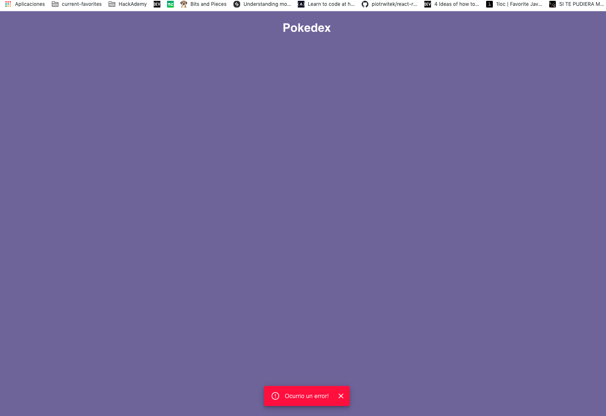
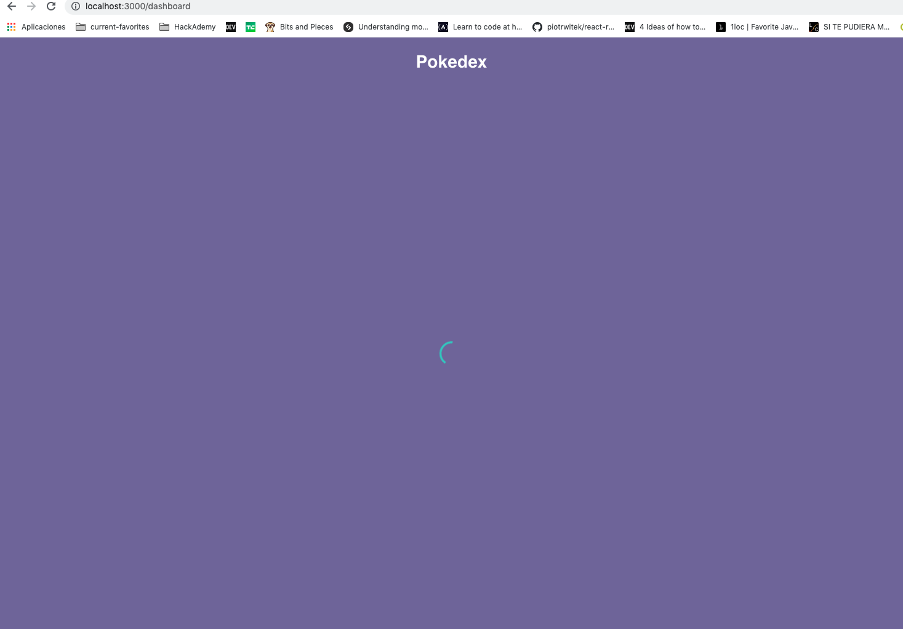
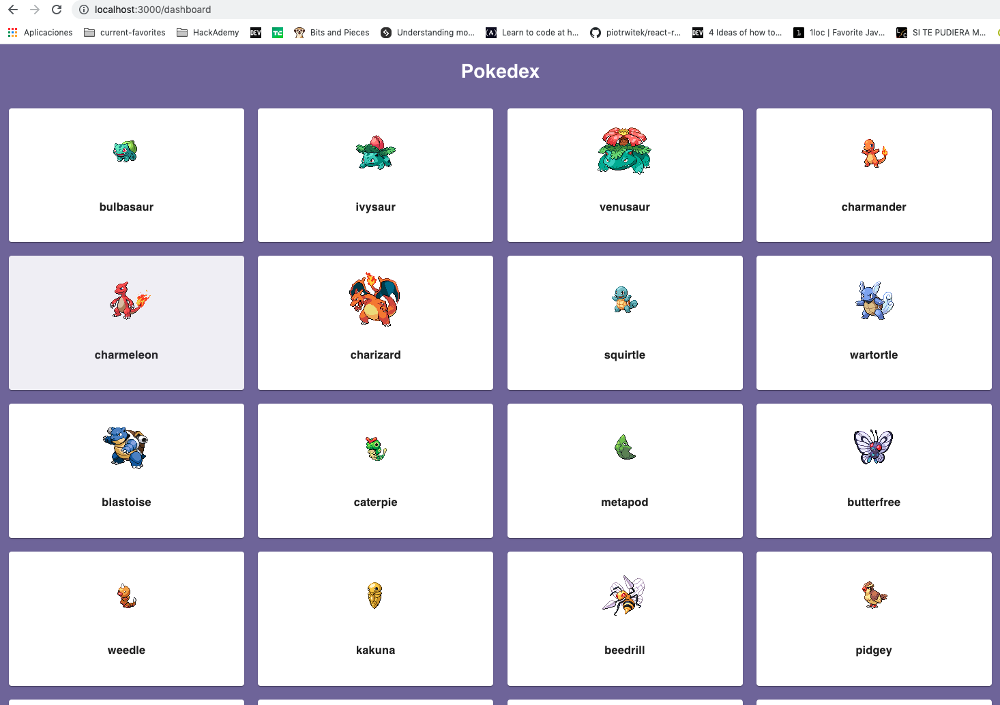
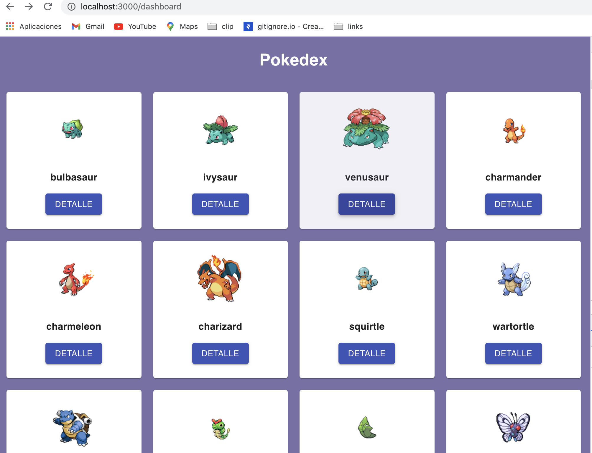
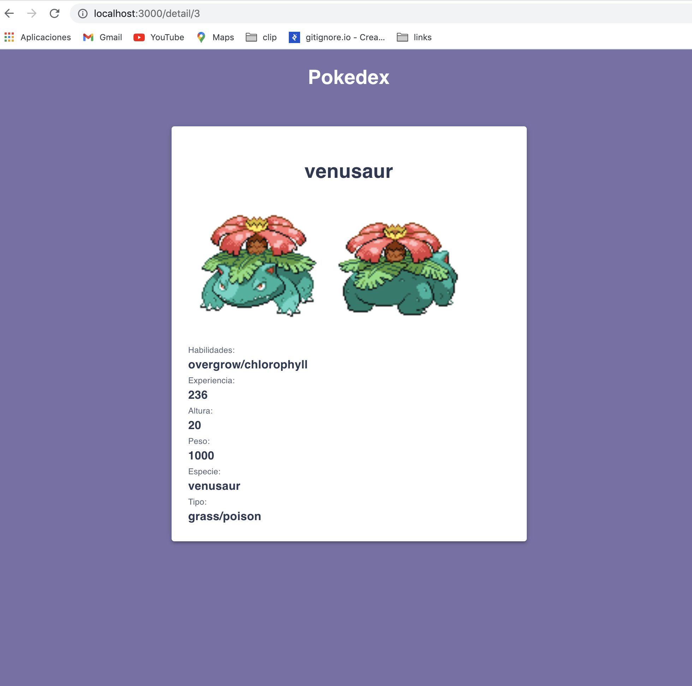

# Pokedex

- Crear un proyecto React con `create-react-app` o usar https://codesandbox.io/

**Dependencias**

- [react-router](https://reactrouter.com/)
- [prop-types](https://www.npmjs.com/package/prop-types)
- [material-ui](https://material-ui.com/)
- [axios](https://www.npmjs.com/package/axios)

**APIs**

- [pokeapi](https://pokeapi.co/)
- [mockapi](https://mockapi.io/)

## V1.1.0 - Listado de pokemons

- Configurar material-ui para usar los componentes de este design system.
- Crear una ruta llamada `/dashboard` para listar los pokemons.
- El listado mostrara cada item dentro de una card con la imagen del pokemon.
- El recurso para recuperar la lista sera acceder al api de pokeapi con el endpoint `https://pokeapi.co/api/v2/pokemon?limit=600` para acceder a 600 pokemons.
- Para recuperar la imagen se usa este link `https://raw.githubusercontent.com/PokeAPI/sprites/master/sprites/pokemon/{id_de_pokemon}.png` se necesita enviarle el id del pokemon.
- Obtener el id del pokemon e.g.:

```javascript
const url = "https://pokeapi.co/api/v2/pokemon/1/";
const apiUrl = "https://pokeapi.co/api/v2/pokemon/";

const id = url.replace(apiUrl, "").replace("/", "");
console.log("ID", id); // 1
```

**Estados del componente**

- **Loading:** Cuando se ejecute la consulta mostrar un loading miestras se resuelve la petición.
- **Error:** mostrar error si la petición falla.
- **Lista vacia:** en caso de que la petición retorne algo vacio.
- **Success:** se muestra el listado.

## Vista

**ERROR:**


**LOADING**


**LIST**


## V1.2.0 - Detalle

- Crear ruta para vizualizar el detalle `/detail/:pokemonId`
- Mostar el detalle del pokemon accediendo a `https://pokeapi.co/api/v2/pokemon/{pokemonId}/` y obteniendo el `pokemonId` de la ruta.

- Detalle:

* Nombre (name)
* imagen frontal y trasera (sprites: front_default, back_default)
* abilidades (abilities)
* experiencia (base_experience)
* altura (height)
* peso (weight)
* especie (species.name)
* tipos (types.type.name)

**Estados del componente**

- **Loading:** Cuando se ejecute la consulta mostrar un loading miestras se resuelve la petición.
- **Error:** mostrar error si la petición falla.
- **Success:** se muestra el detalle.

## Vista

**LISTA CON BTN DETALLE:**


**DETALLE:**


## v1.3.0 - Agregar pokemon a mi pokedex:

- Crear componente con btn de guardar
- numero de pokemons guardados
- Btn de cancelar
- Si el pokemon es seleccionado deshabilitr btn de guardar

## v1.4.0 - Listado de pokemons guardados:

- Eliminar pokemon
- Ir al detalle del pokemom

## v1.5.0 - Mostar solo la lista de pokemones no guardados

## v2.0.0 - desacoplar componentes con context, useReducer

## v2.0.1 - Estilo responsivo

## v2.1.0 - subir a netlify
